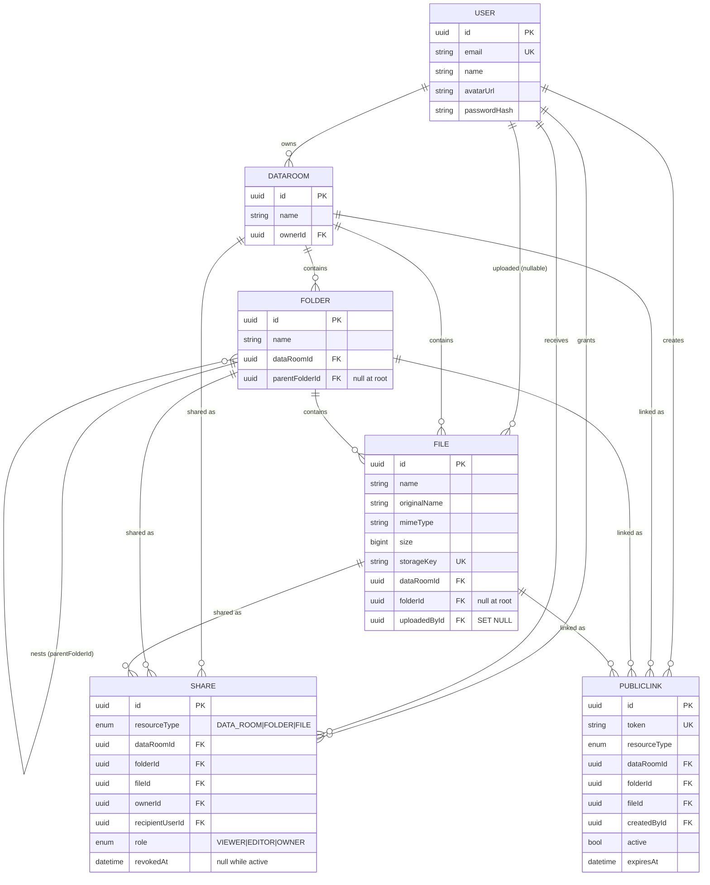

# Data Room

A secure virtual data room: nested folders, PDF uploads, in-browser preview, and
sharing by public link or by granting a specific account read-only access.

Every permission decision is made by the backend. The frontend hides controls the
user cannot use, but hiding is cosmetic — changing an id in the URL, or calling
the API directly, gets the same answer.

---

## Features

**Data rooms**
- Register / sign in / sign out; a first data room is provisioned on sign-up
- Create additional rooms; the sidebar separates what you own from what was shared with you
- Room header with folder count, file count and total size

**Folders**
- Create at the root or inside any folder, nested arbitrarily deep
- Rename, with duplicate names rejected per parent
- Recursive delete behind a confirmation that states exactly what goes:
  folder count, file count and total size of the subtree
- Clickable breadcrumbs; navigation is reflected in the URL
  (`/dataroom/:id`, `/dataroom/:id/folder/:folderId`)

**Files**
- Multi-file upload by drag-and-drop or file picker, straight to storage with
  presigned URLs
- Per-file progress, per-file errors with retry — one failure never blocks the rest
- PDF-only: extension, declared MIME type, size, and the file's actual magic
  bytes are all checked
- Preview in a dialog from a short-lived signed URL
- Rename, move between folders, delete (storage object included)
- Duplicate names are never silently overwritten: the API answers with a
  suggested name and the UI offers "keep both"

**Sharing**
- Three resource types: data room, folder, file
- Public link — anyone with the URL can browse the shared subtree and preview
  PDFs without an account; disabling it takes effect immediately
- Permissioned share — read-only access for a registered account, revocable
- Access is inherited down the subtree; a single share covers everything below it
- Recipients cannot modify anything, and cannot re-share

**UX**
- Skeletons for every async view, empty states per folder, retryable error states
- Confirmation dialogs for destructive actions, controls disabled while a
  mutation runs, toast feedback
- Graceful handling of the awkward cases: a folder deleted while you are looking
  at it, a share revoked mid-session, a file deleted while its preview is open,
  an expired session

---

## Tech stack

| Layer | Choice | Why |
| --- | --- | --- |
| Frontend | Next.js 16 (App Router), React 19, TypeScript | File-based routing, React Server Components where they help, first-class Vercel deploys |
| UI | Tailwind CSS v4, shadcn/ui (Base UI), lucide icons | Composable primitives, accessible dialogs and menus without a heavy design system |
| Server state | TanStack Query | Caching, background refetch, cursor pagination, mutation state |
| Forms | React Hook Form + Zod | Typed schemas shared between validation and inference |
| Backend | NestJS 12 (ESM), TypeScript | Modules and DI keep authorization in one service instead of scattered across controllers |
| ORM | Prisma 7 with the `pg` driver adapter | Typed queries, migrations, raw CTEs where the tree needs them |
| Database | PostgreSQL (Supabase) | Recursive CTEs, real constraints, `NULLS NOT DISTINCT` unique indexes |
| Storage | Supabase Storage (S3-compatible) | Presigned PUT/GET so bytes never pass through the API |
| Auth | Email + password, argon2, JWT in an httpOnly cookie | Simple, no third-party dependency, and the API stays authoritative |

---

## Architecture

```text
Browser
  │  session cookie (httpOnly, SameSite=None in production)
  ▼
Next.js (Vercel)              ── renders the app; holds no secrets
  │  REST + credentials
  ▼
NestJS API (Railway)          ── the only place permissions are decided
  ├─► PostgreSQL (Supabase)   ── rooms, folders, files, shares, links
  └─► S3-compatible storage   ── issues presigned URLs
        ▲
        └─ browser uploads and downloads objects directly
```

Uploads and previews never stream through the API. The API authorises the
operation and signs a short-lived URL; the browser then talks to storage
directly. Storage credentials stay on the server, and the bucket is private.

### Repository layout

```text
apps/
  api/                 NestJS
    prisma/            schema, migrations, seed
    src/
      auth/            register, login, logout, me
      users/
      authorization/   AuthorizationService — the single source of truth
      datarooms/
      folders/         folders + listing (cursor pagination)
      files/           upload authorisation, confirmation, file operations
      shares/          permissioned shares
      public-links/    link management + anonymous browsing
      storage/         S3 client, presigning, object cleanup
      common/          guards, decorators, filters, name normalisation
  web/                 Next.js
    src/app/           routes: (auth), (app), public/[token]
    src/components/    layout, browser, dialogs, upload, sharing, files, ui
    src/lib/           api client, query keys, validation, formatting
```

---

## Local setup

Prerequisites: Node 20+, pnpm 11+, a PostgreSQL database and an S3-compatible
bucket (Supabase provides both).

```bash
pnpm install

# API configuration
cp .env.example apps/api/.env        # fill in DATABASE_URL, AUTH_SECRET, S3_*
# Web configuration
cp .env.example apps/web/.env.local  # keep only the NEXT_PUBLIC_* lines

pnpm db:generate                     # Prisma client
pnpm db:migrate                      # apply migrations
pnpm db:seed                         # demo user, folder tree, sample PDFs

pnpm dev                             # web on :3000, API on :4000
```

Seeded accounts (password `demo1234` for both):

| Email | Role in the demo |
| --- | --- |
| `demo@dataroom.app` | owns the Acquisition Data Room |
| `viewer@dataroom.app` | second account, for trying permissioned shares |

The seed generates small valid PDFs at runtime and uploads them, so no binaries
are committed. Re-running it removes the previous objects from storage first, so
it never leaves orphaned blobs behind.

**Supabase note:** the direct database host (`db.<ref>.supabase.co`) resolves to
IPv6 only. If your network has no IPv6 route, use the pooler host
(`aws-0-<region>.pooler.supabase.com`, user `postgres.<ref>`) for both
`DATABASE_URL` and `DIRECT_URL`.

### Checks

```bash
pnpm --filter api typecheck && pnpm --filter api build
pnpm --filter api test:e2e     # authorization, sharing and public link coverage
pnpm --filter web typecheck && pnpm --filter web build
pnpm --filter web lint
```

---

## Deployment

| Piece | Where | Notes |
| --- | --- | --- |
| Web | Vercel | Root directory `apps/web`; the build is a normal Next.js build (`apps/web/vercel.json` pins the install/build commands and marks `/public/*` `noindex`) |
| API | Railway (or any Docker host) | `apps/api/Dockerfile`, built from the repository root; `apps/api/railway.json` sets the Dockerfile path and `/health` as the health check |
| Database | Supabase PostgreSQL | Migrations run on container start (`prisma migrate deploy`), so a deploy can never serve a schema it does not have |
| Storage | Supabase Storage (private bucket) | Only the API holds the credentials |

Cross-origin notes, since the two apps live on different domains:

- set `CORS_ORIGINS` on the API to the exact Vercel URL (comma-separated if there
  is more than one);
- session cookies are issued with `SameSite=None; Secure` when `NODE_ENV` is
  `production`, which is what makes the cross-site cookie work;
- set `NEXT_PUBLIC_API_URL` on Vercel to the API's public URL, and
  `NEXT_PUBLIC_APP_URL` to the web app's own URL — public share links are built
  from it.

The API image is deliberately self-sufficient: it installs OpenSSL for Prisma's
query engine and pins pnpm at build time so a container never pauses to download
a package manager on boot.

---

## Environment variables

Everything lives in `.env.example`. The API reads its variables through a Zod
schema at boot and refuses to start if any are missing or malformed.

| Variable | Where | Purpose |
| --- | --- | --- |
| `DATABASE_URL` | api | PostgreSQL connection used at runtime |
| `DIRECT_URL` | api | Connection used by Prisma Migrate (falls back to `DATABASE_URL`) |
| `AUTH_SECRET` | api | HMAC secret for session JWTs; at least 16 characters |
| `AUTH_TOKEN_TTL` | api | Session lifetime, e.g. `7d` |
| `S3_ENDPOINT` | api | S3-compatible endpoint |
| `S3_REGION` | api | Bucket region |
| `S3_ACCESS_KEY_ID` | api | Storage credentials — never sent to the browser |
| `S3_SECRET_ACCESS_KEY` | api | ” |
| `S3_BUCKET` | api | Private bucket name |
| `S3_URL_TTL` | api | Lifetime of presigned URLs, in seconds |
| `MAX_FILE_SIZE` | api | Upload limit in bytes (default 50 MB) |
| `CORS_ORIGINS` | api | Comma-separated origins allowed to send credentials |
| `PORT` | api | HTTP port |
| `NEXT_PUBLIC_API_URL` | web | Base URL of the API |
| `NEXT_PUBLIC_APP_URL` | web | Public base URL, used to build shareable links |
| `NEXT_PUBLIC_MAX_FILE_SIZE` | web | Mirrors `MAX_FILE_SIZE` for early client-side rejection |

---

## Data model



Constraints worth calling out:

- `Folder(dataRoomId, parentFolderId, name)` and `File(dataRoomId, folderId, name)`
  are unique **with `NULLS NOT DISTINCT`**, so two `Legal` folders cannot exist at
  the root either — PostgreSQL would otherwise treat the two `NULL` parents as
  distinct.
- `File.storageKey` is unique, so one uploaded object can back at most one row.
- Deleting a folder cascades to nested folders and files; deleting a data room
  cascades to everything in it. Storage objects are removed first (see below).
- `File.uploadedById` is nullable with `ON DELETE SET NULL`: documents must
  outlive the account that uploaded them.

---

## How authorization works

All of it lives in `AuthorizationService`. Controllers only ask questions:

```ts
requireDataRoomRead(userId, dataRoomId)
requireDataRoomEdit(userId, dataRoomId)
requireFolderRead(userId, folderId)     requireFolderEdit(userId, folderId)
requireFileRead(userId, fileId)         requireFileEdit(userId, fileId)
```

Each call resolves a grant from two possible sources:

1. **Ownership** — the user owns the data room the resource lives in. Owners get
   the `OWNER` role, which implies read, edit and share.
2. **An active share** — a `Share` row for this user, not revoked, pointing at
   the resource *or at any ancestor container*. The folder's ancestry is resolved
   with one recursive CTE, so a share on `Legal` covers `Legal/Contracts/2026`
   without a row per descendant.

Two deliberate choices:

- **Invisible and missing look identical.** A resource the caller may not see
  answers `404`, not `403`, so probing ids never confirms that someone else's
  data room exists. `403` is reserved for the case where the user *can* see the
  resource but lacks the rights for that particular action ("You have read-only
  access to this item").
- **Sharing rights are not inherited.** Only the data room owner can create or
  revoke shares and public links, so a viewer cannot pass their access on.

Public links are handled by a separate `PublicAccessService`. There is no user in
that path — only a token, the subtree it covers, and read-only operations. Every
public request re-resolves the token, so disabling a link takes effect on the
next request, and breadcrumbs stop at the shared root so nothing above it leaks.

---

## Storage lifecycle

Uploads are three steps, and a row only appears at the end:

1. `POST /files/upload-url` — the API authorises the destination, validates name,
   size and type, and returns a presigned `PUT` plus a generated storage key
   (`dataroom/{dataRoomId}/{uuid}` — never derived from the file name).
2. The browser `PUT`s the bytes straight to storage.
3. `POST /files` — the API confirms the object exists, checks its real size and
   its `%PDF-` magic bytes, resolves any name conflict, and only then writes the
   `File` row.

An abandoned upload therefore leaves an unreferenced object and no row; if the
user cancels, the client calls `POST /files/discard` and the object is deleted.

Deletes go the other way round: **storage object first, then the row.** A failed
blob delete is logged and reported in the response (`orphanedObjects`) rather
than aborting the operation. The alternative — deleting rows first — risks files
that are visible in the UI but missing from the bucket, which is worse than an
unreferenced object nobody can reach. For folders, the subtree's storage keys are
collected with a recursive CTE, deleted in batches of 1000, and then the folder
row is removed so the database cascade takes care of the rest.

---

## How It Scales

### 1. Total size and item count for a folder subtree

Today: one recursive CTE per request, walking `Folder.parentFolderId` from the
target folder down, joined against `File` for the aggregates.

```sql
WITH RECURSIVE subtree AS (
  SELECT id FROM "Folder" WHERE id = $1
  UNION ALL
  SELECT child.id FROM "Folder" child
  JOIN subtree parent ON child."parentFolderId" = parent.id
)
SELECT (SELECT COUNT(*) FROM subtree) - 1 AS folder_count,
       COUNT(f.id)                        AS file_count,
       COALESCE(SUM(f.size), 0)           AS total_size
FROM subtree LEFT JOIN "File" f ON f."folderId" = subtree.id;
```

It is called in exactly two places — the delete confirmation dialog and the
folder stats endpoint — never during normal navigation. Room-level totals in the
header do not use it at all: every folder and file carries `dataRoomId`, so the
header is two indexed aggregates with no tree walk.

This does not stay free. The CTE is O(subtree size), so on a room with hundreds
of thousands of files a delete dialog on the root would scan the whole thing.

**The practical next step: materialised subtree aggregates.** Give `Folder` three
maintained columns — `descendantFolderCount`, `descendantFileCount`,
`subtreeSize` — and update them on the affected ancestor chain whenever a file is
added, removed, moved or resized. The chain is bounded by tree depth (single
digits in practice), the update happens in the same transaction as the change,
and reads become a single-row lookup. When contention on hot ancestors becomes
the problem, the same updates move to a background job fed by an outbox table,
and the UI shows a value that may be seconds stale — acceptable for a size
readout, not for permissions.

Closure tables and materialised paths solve a different half of the problem
(ancestor lookups, which the CTE already handles cheaply) at the cost of
maintaining O(depth) rows per node, so they are not the first thing to reach for
here. If the folder tree itself grew huge and deep, a materialised path column
(`/root/legal/contracts/`) with a `text_pattern_ops` index would make
"everything under X" a prefix scan and would be the natural companion.

### 2. What changes at 100,000 files

**Pagination.** Already cursor-based and already the default. Listing a location
returns direct children only, in two independently paginated sets — folders and
files — each fetched as `WHERE (dataRoomId, parentFolderId/folderId) = … ORDER BY
name, id LIMIT n+1`, which is an indexed range scan whose cost does not grow with
the size of the room. Offset pagination was avoided precisely because
`OFFSET 90000` reads and discards 90,000 rows. The extra row per page tells the
client whether a next page exists; the cursor is the last id of the page.

**Nothing recursive on the navigation path.** Opening a folder reads its direct
children and its breadcrumb chain. The only recursive queries in the codebase are
the ancestry check used for shared-subtree permissions (bounded by depth) and the
subtree stats described above.

**Indexes.** Present today:

```text
Folder(dataRoomId), Folder(parentFolderId)
File(dataRoomId),   File(folderId), File(createdAt), File(name)
File(storageKey) unique
Share(recipientUserId, revokedAt), Share(dataRoomId|folderId|fileId), Share(ownerId)
PublicLink(token) unique, PublicLink(dataRoomId|folderId|fileId)
DataRoom(ownerId)
Folder(dataRoomId, parentFolderId, name) unique NULLS NOT DISTINCT
File(dataRoomId, folderId, name)         unique NULLS NOT DISTINCT
```

The listing queries sort by `(name, id)` within a parent, so the composite unique
indexes already cover them. The next index to add — once query statistics
justify it rather than guesswork — would be `File(folderId, name, id)` to make the
sort order an index-only scan.

`Share(recipientUserId, revokedAt)` matters more than it looks: it is read on
every permission check for a non-owner.

**Where the remaining cost sits.** With 100k files the expensive operations are
the ones that touch a whole room: recursive delete (collecting storage keys),
room-level aggregates, and storage cleanup. Deleting a large folder would move to
a background job — mark the subtree deleted, return immediately, let a worker
remove the objects — with an outbox table of pending deletions so a crashed
worker resumes rather than orphaning blobs.

**Search.** Not implemented. Names are the only searchable field, so the first
step is a trigram index (`pg_trgm` + `gin (name gin_trgm_ops)`) which serves
`ILIKE '%contract%'` well up to millions of rows, scoped to the rooms the caller
may read so results can never leak across permissions. Full-text over document
contents is a different system — extract text on upload, index it in Postgres FTS
or a dedicated search service — and would only be worth it once names are not
enough.

### 3. How sharing extends to per-user roles (viewer / editor) without remodelling

The database already supports it. `Share.role` is an enum with `VIEWER`, `EDITOR`
and `OWNER`; only `VIEWER` is handed out today, and the DTO accepts only that
value.

`AuthorizationService` never asks "is this user the owner?" when deciding whether
a write is allowed. It resolves a grant, takes the highest role among ownership
and all covering shares, and compares it against a required level:

```ts
const ROLE_RANK = { VIEWER: 1, EDITOR: 2, OWNER: 3 };
canEdit(grant) === ROLE_RANK[grant.role] >= ROLE_RANK.EDITOR;
```

Turning on editors is therefore:

1. widen the DTO to accept `EDITOR` (`@IsIn([VIEWER, EDITOR])`);
2. add the role picker to the share dialog;
3. decide the one genuinely new policy question — whether an editor may re-share.
   Today `requireOwnedResource` gates sharing on ownership; if editors should be
   able to invite others, that check becomes a role comparison like the rest.

No migration, no new tables, and no change to how inheritance is resolved: an
`EDITOR` share on a folder grants editing across its whole subtree by the same
ancestry walk that grants reading now. The same mechanism extends to roles like
`COMMENTER` — add the enum value, give it a rank, and gate the new capability on
that rank.

---

## Security

- **Passwords** are hashed with argon2id. Login answers identically for an
  unknown email and a wrong password, and still spends the hashing time in the
  unknown-email case so timing does not distinguish the two.
- **Sessions** are JWTs in an httpOnly cookie (`SameSite=None; Secure` in
  production, where the app and API sit on different domains). Bearer tokens are
  also accepted, which keeps the API usable from tests and curl.
- **Authentication is on by default**: the JWT guard is registered globally and
  routes opt out explicitly with `@Public()`, so a new controller is protected
  unless someone deliberately opens it.
- **Every resource lookup goes through `AuthorizationService`.** Ids from the
  client are treated as untrusted input; a mismatched `dataRoomId`/`folderId`
  pair is rejected rather than trusted.
- **Storage credentials never reach the browser.** The bucket is private; the
  client only ever sees presigned URLs valid for `S3_URL_TTL` seconds.
- **Uploads are validated on the server**: extension, declared MIME type, size
  against `MAX_FILE_SIZE`, the object's real size after upload, and its `%PDF-`
  magic bytes. A spoofed file is deleted from storage and rejected.
- **Storage keys are generated** (`dataroom/{dataRoomId}/{uuid}`), never derived
  from user input, and a key is validated against the room it claims to belong
  to. Display names are normalised: trimmed, whitespace collapsed, control
  characters stripped, `/` and `\` replaced, `.`/`..` rejected.
- **Public tokens** are 24 random bytes (`base64url`), never sequential ids.
- **Input validation** is global (`whitelist`, `forbidNonWhitelisted`), so unknown
  fields are rejected outright rather than silently ignored.
- **Errors are structured and safe**: a stable code, a message written for the
  end user, and never a stack trace. Internal failures are logged server-side.

---

## API

```text
POST   /auth/register        POST /auth/login      POST /auth/logout     GET /auth/me

GET    /datarooms            POST /datarooms       GET  /datarooms/:id
GET    /datarooms/:id/items  GET  /datarooms/:id/tree

POST   /folders              GET  /folders/:id     PATCH /folders/:id    DELETE /folders/:id
GET    /folders/:id/items    GET  /folders/:id/stats

POST   /files/upload-url     POST /files           POST  /files/discard
GET    /files/:id            GET  /files/:id/preview
PATCH  /files/:id            POST /files/:id/move  DELETE /files/:id

POST   /shares               GET  /shares?resourceType&resourceId
GET    /shares/received      DELETE /shares/:id

POST   /public-links         GET  /public-links?resourceType&resourceId
DELETE /public-links/:id

GET    /public/:token        GET  /public/:token/items
GET    /public/:token/files/:fileId/preview

GET    /health
```

Errors share one shape:

```json
{
  "statusCode": 409,
  "code": "ALREADY_EXISTS",
  "message": "“contract.pdf” already exists in this folder.",
  "details": { "suggestedName": "contract (1).pdf" }
}
```

---

## Testing

`apps/api/test/authorization.e2e-spec.ts` boots the real application — global
guard, pipes and exception filter included — against the database and covers the
behaviour that matters most:

- owner access, another user's room hidden behind `404`, unauthenticated `401`
- folder nesting and breadcrumbs, duplicate folder names rejected
- subtree counts verified before a recursive delete, and the delete cascading
- duplicate file names: a conflicting rename returns a suggestion; `keepBoth`
  applies it instead of overwriting
- a folder share granting the whole subtree, staying read-only, being
  un-re-shareable by the recipient, and stopping the moment it is revoked
- a file share exposing that file but not the folder around it
- public links browsing the shared subtree, refusing folders outside it, and
  failing to resolve once disabled

Run them with `pnpm --filter api test:e2e`.

---

## Known limitations

- Search and filtering are not implemented (see *How It Scales* for the approach).
- File versioning is not implemented; duplicate uploads become separate files.
- Only `VIEWER` is granted today; `EDITOR` exists in the model but is not offered.
- Folders can be renamed and deleted but not moved (files can be moved).
- Subtree statistics are computed on demand; see the materialisation plan above.
- Storage cleanup is best-effort and logged: an object that fails to delete is
  reported but not retried by a background job yet.

---

## AI Usage

AI tooling (Claude Code) was used throughout this project for:

- scaffolding the monorepo, the NestJS modules and the Next.js routes
- generating first drafts of services, components and tests
- debugging (Supabase's IPv6-only direct host, Prisma 7's config and adapter
  changes, Base UI's `render` prop replacing `asChild`)
- refactoring and documentation, including this README

Every generated change was reviewed and adjusted, and the behaviour was verified
against a real database and a real S3 bucket — the authorization, sharing,
revocation, upload-validation and public-link flows were each exercised
end-to-end rather than assumed to work.
